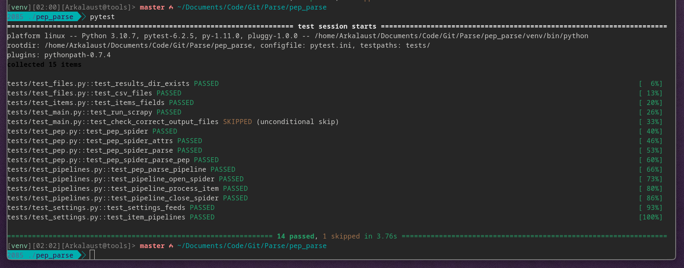

# Асинхронный парсинг на Scrapy + Alchemy

Парсер предназначен для сбора информации о нововведениях Python и количестве статусов документов PEP.

Собирает все (Номера, Названия, Статусы) с https://peps.python.org/ и формирует два файла csv и записи в БД (sqlite) через SQLAlchemy. (Примеры есть в директории results/)

## Подготовка к запуску проекта

Для начала, клонируйте репозиторий:

```bash
git clone https://github.com/budaevdigital/scrapy_parse_pep.git
```

Перейдите в скаченную директорию проекта:

```bash
cd scrapy_parse_pep
```

Создайте и активируйте виртуальное окружение:

```bash
python -m venv venv && source env/bin/activate
```

Установите все необходимые зависимости для работы проекта:

```bash
pip install -r requirements.txt
```

## Запуск парсера

Для запуска, выполните команду в корневой директории проекта:

```bash
scrapy crawl pep
```

По окончанию работы парсера, будет созданно 3 файла в директории `results/`:

- Список всех PEP с их статусами (в csv файле);
- Сумарное количество статусов и общее количество PEP (в csv файле);
- База данных sqlite со списком всех PEP и статусов.

## Авторство

Асинхронный парсинг сайта документации PEP с помощью Scrapy и Alchemy написан мной (Будаевым Дмитрием).

Тесты написаны командой Яндекс.Практикума - за что им огромная благодарность!


